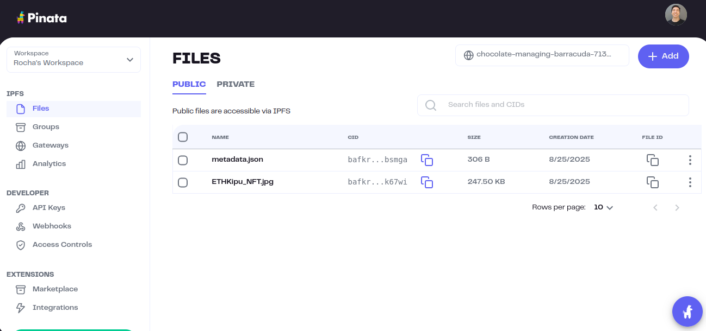
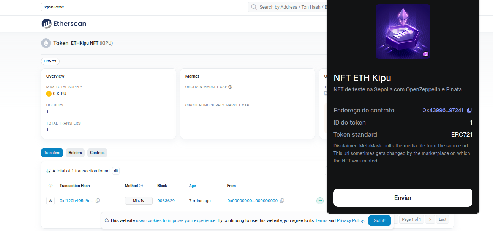

# 🎨 NFT on Sepolia Network

This repository demonstrates the creation, deployment, and minting of an **ERC-721 NFT** on the **Sepolia testnet**, using:

- **Remix IDE** for development and deployment.  
- **OpenZeppelin** for secure, standardized contracts.  
- **Pinata + IPFS** for hosting the NFT image and metadata.  

---

## 📂 Project Structure
```
.
├── contracts/
│   └── sepoliaNFT.sol      # ERC-721 contract based on OpenZeppelin
├── metadata.json           # NFT metadata hosted on Pinata
├── ETHKipu_NFT.jpg         # NFT artwork image
└── README.md               # This guide
```

---

## 🚀 Step by Step Guide

### 1. Upload files to Pinata
1. Create an account at [Pinata](https://app.pinata.cloud/).  
2. Upload the image `ETHKipu_NFT.jpg`.  
   - This generates a CID (e.g., `bafkreifq7...k67wi`).  
   - Image link:  
     ```
     ipfs://bafkreifq7bqcfxauh4mo3fu4okaep3al4ngagxdy2ha6cz27wwa63k67wi
     ```
3. Create the `metadata.json` file (already included in this repo):

```json
{
  "name": "NFT ETH Kipu",
  "description": "Test NFT on Sepolia using OpenZeppelin and Pinata.",
  "image": "ipfs://bafkreifq7bqcfxauh4mo3fu4okaep3al4ngagxdy2ha6cz27wwa63k67wi", 
  "attributes": [
    { "trait_type": "Rarity", "value": "Epic" },
    { "trait_type": "Version", "value": "1.0" }
  ]
}
```

📌 Example metadata file:  


4. Upload `metadata.json` to Pinata.  
   - This CID will be used as the `tokenURI` when minting.  
   - Example:  
     ```
     ipfs://bafkreibsmga...
     ```

---

### 2. Create the contract in Remix
1. Go to [Remix IDE](https://remix.ethereum.org/).  
2. Create `sepoliaNFT.sol` under `contracts/` and paste the following code:

```solidity
// SPDX-License-Identifier: MIT
pragma solidity ^0.8.24;

import "@openzeppelin/contracts/token/ERC721/extensions/ERC721URIStorage.sol";
import "@openzeppelin/contracts/access/Ownable.sol";

contract ETHKipuNFT is ERC721URIStorage, Ownable {
    uint256 private _nextTokenId = 1;

    constructor(string memory name_, string memory symbol_)
        ERC721(name_, symbol_)
        Ownable(msg.sender)
    {}

    function mintTo(address to, string memory tokenURI_) external onlyOwner returns (uint256 tokenId) {
        tokenId = _nextTokenId++;
        _safeMint(to, tokenId);
        _setTokenURI(tokenId, tokenURI_);
    }
}
```
📌 Remix deployment example:  


3. In the **Solidity Compiler**, select `0.8.24` and compile.  
4. In **Deploy & Run**, select **Injected Provider (Metamask)** → choose the **Sepolia** network.  
5. Deploy the contract with:  
   - Name: `ETH Kipu NFT`  
   - Symbol: `KIPU`

---

### 3. Mint the NFT
1. In **Deployed Contracts**, expand `mintTo`.  
2. Parameters:  
   - `to`: your Metamask wallet address.  
   - `tokenURI_`: the CID of `metadata.json` (example `ipfs://...`).  
3. Click **transact** and confirm in Metamask.  

---

### 4. Verify on Etherscan & Metamask
- You can see your contract and transactions on [Sepolia Etherscan](https://sepolia.etherscan.io/).  
- The NFT will automatically appear in **Metamask (NFTs tab)** when you add the contract address.  

📌 NFT created example:  

---

## ✅ Result
The **ETH Kipu NFT** was successfully created:  

- **Image hosted on IPFS/Pinata**  
- **Metadata JSON** linking artwork to the contract  
- **ERC-721 contract** compiled and deployed via Remix  
- **NFT minted on Sepolia** and visible in Metamask/Etherscan  

---

## 🔗 References
- [OpenZeppelin Contracts](https://docs.openzeppelin.com/contracts/)  
- [Remix IDE](https://remix.ethereum.org/)  
- [Pinata](https://www.pinata.cloud/)   

---
